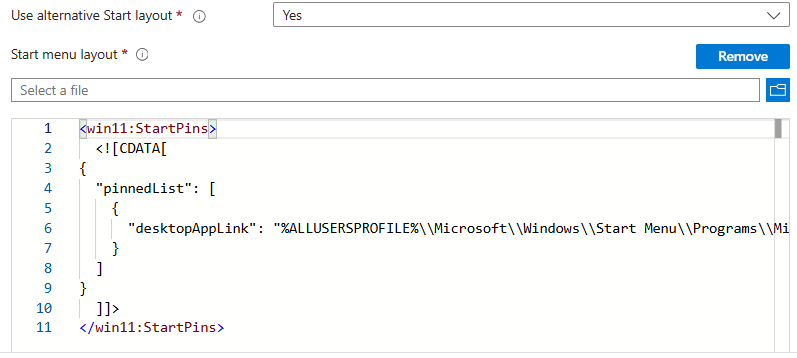

# Issue: Windows 11 Kiosk Multi-App Start Menu Pins Not Applying
*Applies to: Windows 11, Intune, Kiosk Multi-App Mode*

## Scenario
Customer configured a Kiosk (multi-app) profile via Intune, but the **Start menu pins do not apply** on Windows 11 devices.  

## Symptom
- Start menu pins fail to appear on Windows 11 kiosk devices.  
- Intune logs show policy applied, but layout not reflected.  
- No explicit error visible to end-user (silent failure).  

## Root Cause
1. **Unsupported Start Layout Configuration**  
   - The XML layout format (`<defaultlayout:StartLayout>`) is **only supported on Windows 10**.  
   - Windows 11 uses **pinnedList JSON format** instead.  
 
2. **Incorrectly Nested StartPins Configuration in Intune**  
   - Switching to pinnedList inside Intune UI results in **nested CDATA blocks** like:  
     ```
     <StartLayout><![CDATA[
     <win11:StartPins>
       <![CDATA[ { "pinnedList": [ … ] } ]]]
     </win11:StartPins>]]></StartLayout>
     ```
   - This invalid XML causes silent failure on Windows 11 devices.  
   
---

## Recommendation
- Use **OMA-URI with AssignedAccess XML** instead of legacy StartLayout CSP.  
- Create a **custom configuration profile** in Intune with the following OMA-URI:  
    ```
    ./Vendor/MSFT/AssignedAccess/Configuration
    ```
### Example: Working AssignedAccess Configuration
```xml
"MultiAppXml"="<AssignedAccessConfiguration xmlns:rs5=\"http://schemas.microsoft.com/AssignedAccess/201810/config\" xmlns=\"http://schemas.microsoft.com/AssignedAccess/2017/config\" xmlns:win11=\"http://schemas.microsoft.com/AssignedAccess/2022/config\">
<Profiles>
  <Profile Id=\"{4ebc343c-a65c-4916-be45-40df869e605a}\">
    <AllAppsList>
      <AllowedApps>
        <App DesktopAppPath=\"C:\\Program Files\\Zscaler\\ZSATray\\ZSATray.exe\" />
        <App DesktopAppPath=\"C:\\Program Files (x86)\\Microsoft\\Edge\\Application\\msedge.exe\" rs5:AutoLaunch=\"true\" />
      </AllowedApps>
    </AllAppsList>
    <win11:StartPins>
      <![CDATA[
{
\"pinnedList\": [
  {
    \"desktopAppLink\": \"%ALLUSERSPROFILE%\\\\Microsoft\\\\Windows\\\\Start Menu\\\\Programs\\\\Microsoft Edge.lnk\"
  }
]
}
      ]]>
    </win11:StartPins>
    <Taskbar ShowTaskbar=\"true\" />
  </Profile>
</Profiles>
<Configs>
  <Config>
    <AutoLogonAccount />
    <DefaultProfile Id=\"{4ebc343c-a65c-4916-be45-40df869e605a}\" />
  </Config>
</Configs>
</AssignedAccessConfiguration>"
```
---

## Recommendation
[Customize the Start layout](https://learn.microsoft.com/en-us/windows/configuration/start/layout?tabs=intune-10%2Ccsp-11&pivots=windows-11)
